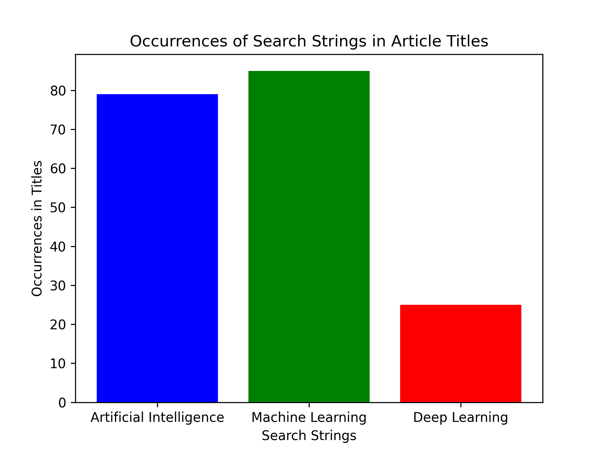

# Web Scraping Assignment - Search Strings and Analysis

## Overview
This project was a part of a Web Mining and Graph Analytics class assignment. The task was to scrape news articles from a news search site using three different search strings and analyze the frequency of these terms in the article titles. The results of the scraping and analysis were saved in CSV files and a bar plot was generated to visualize the occurrences of each search term in the titles.

## Assignment Requirements
The main requirements of the assignment were:
1. **Identify three search strings**:
   - `Artificial Intelligence`
   - `Machine Learning`
   - `Deep Learning`
   
2. **Scrape at least 60 articles for each search term**: We used Selenium for web scraping from Bing News to gather news article titles and their summaries for each search term.

3. **Store the results**: The scraping process collected at least 60 article titles and summaries for each search term. These were saved into CSV files located in the `results` folder. We concatenated the results for the three search strings into a single file called `combined_articles.csv`.

4. **Analyze the results**: We counted how many times each search term appeared in the article titles. This data was saved in a dictionary:
   - `Artificial Intelligence`: 78 occurrences
   - `Machine Learning`: 84 occurrences
   - `Deep Learning`: 25 occurrences
   
5. **Visualize the analysis**: A bar plot was created to show the number of occurrences of each search string in the article titles. The graph can be found in the `results` folder as `search_string_counts.png`.

## Code
The project was implemented using Python, Selenium, and pandas. The key steps involved:
- Using Selenium to scrape article titles and descriptions from Bing News.
- Concatenating the results from the three searches into one table with over 180 instances.
- Counting the occurrences of the search strings in the titles.
- Creating a bar plot to visualize the results.

## Results
All the results, including the concatenated articles and the plot, can be found in the `results` folder:
- `combined_articles.csv`: Contains the article titles and summaries for all three search terms combined.
- `search_string_counts.png`: A bar plot visualizing the number of occurrences of each search string in the article titles.

## How to Use
1. Ensure all dependencies are installed by running: `pip install -r requirements.txt`.
2. Run the scraping script to collect the data: `python single_assignment_solution.py`.
3. View the results in the `results` folder.

## Example Output
The following example shows the bar plot visualizing the occurrences of the search terms in the article titles:

